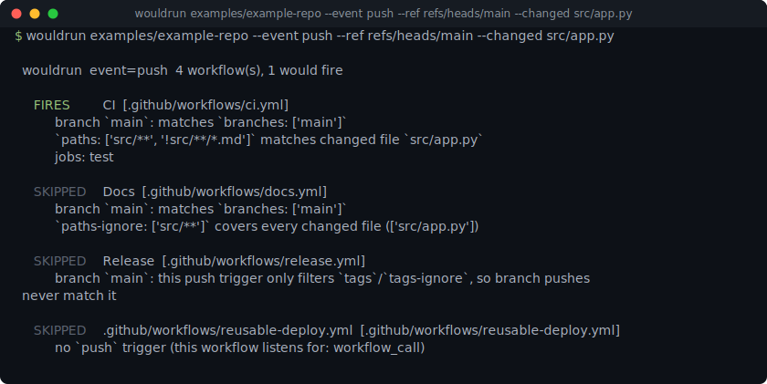

# wouldrun

[](https://github.com/munzzyy/wouldrun/actions/workflows/ci.yml)
[](LICENSE)
[](pyproject.toml)



Answers "given this push, PR, or set of changed files, which of my GitHub Actions
workflows would actually run, and why?" wouldrun reads every workflow under
`.github/workflows/`, resolves the `on:` triggers, branch/tag filters, and path filters
the same way GitHub does, follows `workflow_call` into any reusable workflows it
triggers, and tells you FIRES or SKIPPED with the specific reason for each one. No push,
no `act`, no container.

## Install

Pure standard library, Python 3.9+, no runtime dependencies. Clone it and it runs:

```bash
git clone https://github.com/munzzyy/wouldrun
cd wouldrun
python -m wouldrun --list      # run it directly, no install
pip install -e .               # or install the `wouldrun` command
```

Once it's on PyPI: `pipx install wouldrun`.

## Usage

The repo ships a small example under `examples/example-repo/.github/workflows/`: a CI
workflow gated on `src/**` (but not markdown files in it), a docs workflow that runs on
everything *except* `src/**`, and a release workflow on version tags that calls a
reusable deploy workflow. `--list` shows what each one listens for:

```
$ wouldrun examples/example-repo --list

  CI  [.github/workflows/ci.yml]
    triggers: pull_request, push
    jobs: test

  Docs  [.github/workflows/docs.yml]
    triggers: push
    jobs: build-docs

  Release  [.github/workflows/release.yml]
    triggers: push
    jobs: build, deploy

  .github/workflows/reusable-deploy.yml  [.github/workflows/reusable-deploy.yml]
    triggers: workflow_call
    jobs: deploy
```

A push to `main` that only touches `src/app.py`:

```
$ wouldrun examples/example-repo --event push --ref refs/heads/main --changed src/app.py

  wouldrun  event=push  4 workflow(s), 1 would fire

   FIRES    CI  [.github/workflows/ci.yml]
           branch `main`: matches `branches: ['main']`
           `paths: ['src/**', '!src/**/*.md']` matches changed file `src/app.py`
           jobs: test

   SKIPPED  Docs  [.github/workflows/docs.yml]
           branch `main`: matches `branches: ['main']`
           `paths-ignore: ['src/**']` covers every changed file (['src/app.py'])

   SKIPPED  Release  [.github/workflows/release.yml]
           branch `main`: this push trigger only filters `tags`/`tags-ignore`, so branch pushes never match it

   SKIPPED  .github/workflows/reusable-deploy.yml  [.github/workflows/reusable-deploy.yml]
           no `push` trigger (this workflow listens for: workflow_call)
```

A tag push follows the `workflow_call` chain into the reusable workflow it triggers:

```
$ wouldrun examples/example-repo --event push --ref refs/tags/v1.2.3

  wouldrun  event=push  4 workflow(s), 2 would fire

   FIRES    Release  [.github/workflows/release.yml]
           tag `v1.2.3`: matches `tags: ['v[0-9]+.[0-9]+.[0-9]+']`
           no `paths`/`paths-ignore` filter; matches regardless of changed files
           jobs: build, deploy

   FIRES    .github/workflows/reusable-deploy.yml  [.github/workflows/reusable-deploy.yml]
           no `push` trigger (this workflow listens for: workflow_call)
           not matched directly, but reached anyway: called by `.github/workflows/release.yml` job `deploy`
           jobs: deploy
```

### Feeding it changed files

```bash
wouldrun --changed "src/app.py,docs/x.md"        # inline list
wouldrun --changed-from changed-files.txt        # one path per line
wouldrun --changed-from -                        # read the list from stdin
wouldrun --diff main                             # git diff --name-only main -- , in the target repo
```

### Other events

```bash
wouldrun --event pull_request --base main --changed src/app.py
wouldrun --event pull_request --type labeled --base main
wouldrun --event workflow_dispatch
wouldrun --event schedule
```

### In CI

```yaml
- run: pipx run wouldrun --diff "origin/${{ github.base_ref }}" --exit-fires
```

`--exit-fires` makes the exit code reflect the verdict (0 if at least one workflow would
fire, 1 if none would) instead of the default, which is always 0 so you can pipe the
report into something else without tripping `set -e`.

### Output formats

- default — plain-text report, one block per workflow
- `--json` — the same verdicts and reasons, machine-readable
- `--list` — just workflow names and triggers, no event needed

Full flag reference: `wouldrun --help`.

## What it checks

- `on:` triggers in every shorthand: bare string, list, and mapping form.
- `push`: `branches`, `branches-ignore`, `tags`, `tags-ignore`, `paths`, `paths-ignore`,
  including that a ref filter and a path filter are ANDed together, that
  `branches`/`branches-ignore` and `tags`/`tags-ignore` are independent (a branch-only
  filter excludes tag pushes, and a tags-only filter excludes branch pushes, even
  though neither key looks like it should touch the other ref kind), and that
  declaring `paths` and `paths-ignore` together is what GitHub itself rejects, so
  wouldrun evaluates with `paths` and says so instead of guessing.
- `pull_request` / `pull_request_target`: `branches`/`branches-ignore` against the PR
  base, `paths`/`paths-ignore` against changed files, and `types` against an activity
  type you pass with `--type` (falling back to GitHub's default types when you don't).
- GitHub's filter-pattern glob syntax: `*` (never crosses `/`), `**` (crosses `/`, and
  folds its adjoining `/` so `**/README.md` also matches a root-level `README.md`), `?`
  (zero or one of the character before it), `+` (one or more of the character or
  `[...]` class before it), `[...]` classes with ranges and negation, and `!` negation
  within a `paths`/`branches`/etc. list, processed in order the way GitHub processes it.
  `tests/test_globmatch.py` includes GitHub's own semver tag example,
  `v[12].[0-9]+.[0-9]+`, as a regression case.
- `workflow_call`: if workflow A's job calls `./.github/workflows/b.yml` and A fires, B
  is reported as reached even if B has no trigger of its own that would have matched
  this event. Chains resolve transitively with cycle protection.
- The `on:` boolean-coercion trap: PyYAML's default loader resolves an unquoted `on`
  key to the Python boolean `True` under YAML 1.1 rules, so a workflow's trigger
  silently vanishes the moment you `yaml.safe_load` it. wouldrun doesn't use PyYAML —
  see "How it works" below — and `tests/test_workflow.py` exercises the fallback guard
  directly in case that ever changes.

## What it does not do

- It does not evaluate `if:` conditions or GitHub's `${{ }}` expression language. A job
  gated by `if: github.event_name == 'push'` is reported as part of the workflow's job
  list whenever the workflow fires, regardless of what the condition would actually
  decide at runtime.
- It does not check a `schedule:` cron expression against a clock. It confirms the
  trigger exists and shows you the cron string; whether "now" matches it is out of
  scope.
- It does not model `types:` filters for events other than `pull_request` and
  `pull_request_target`. Other typed events (`issues`, `release`, and so on) are
  reported as firing whenever the event name matches, with no type-level filtering.
- It only reads a job's own `uses:` (the reusable-workflow call). It does not parse
  `steps:`, so step-level `uses:` (an action reference) and `if:` are invisible to it.
- It resolves `workflow_call` only for same-repo local paths (`./.github/workflows/*`).
  A call into another repo's reusable workflow is reported by name but not followed.
- It is a static tool. It never pushes, opens a PR, or runs anything — `--diff` only
  runs `git diff --name-only` with a fixed argument list, read-only.

## How it works

wouldrun does not use PyYAML. `wouldrun/yamlmini.py` is a small, from-scratch reader
for the subset of YAML that workflow files use — block and flow mappings/sequences,
quoted and plain scalars, `|`/`>` block scalars, comments — with one deliberate
difference from PyYAML's default behavior: it resolves booleans the way YAML 1.2's core
schema does (only `true`/`false`), not YAML 1.1's (which also turns `on`, `off`, `yes`,
and `no` into booleans). That difference is the entire reason this project doesn't take
a YAML dependency: the field this tool cares about most, `on:`, is exactly the field
PyYAML's default loader gets wrong. `wouldrun/globmatch.py` translates GitHub's
filter-pattern glob syntax into a Python regex and matches the whole ref or path
against it. `wouldrun/evaluate.py` is the trigger-matching engine described above.
Nothing here calls a model, makes a network request, or writes anything; `--diff` is
the one place it shells out, and it does so with a fixed `argv` list, never a shell
string.

## Contributing

Found a case where wouldrun's verdict disagrees with what GitHub actually did? Open an
issue with the workflow snippet and the event that exposed it. Bug fixes land with a
test in `tests/test_evaluate.py` or `tests/test_globmatch.py` so a fixed case stays
fixed; see [CONTRIBUTING.md](CONTRIBUTING.md).

## License

MIT — free to use, change, and ship, commercial or not. See [LICENSE](LICENSE).