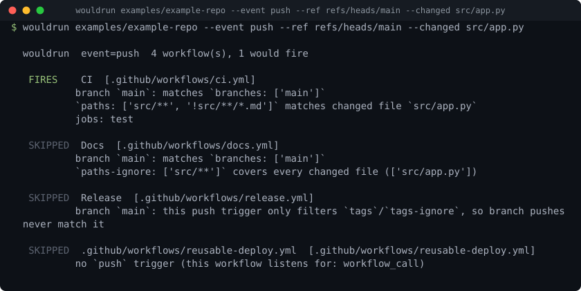

# wouldrun

[](https://github.com/munzzyy/wouldrun/actions/workflows/ci.yml)
[](LICENSE)
[](pyproject.toml)



Answers "given this push, PR, or set of changed files, which of my GitHub Actions
workflows would actually run, and why?" wouldrun reads every workflow under
`.github/workflows/`, resolves the `on:` triggers, branch/tag filters, and path filters
the same way GitHub does, follows `workflow_call` into any reusable workflows it
triggers, and tells you FIRES or SKIPPED with the specific reason for each one. No push,
no `act`, no container.

## Install

Pure standard library, Python 3.9+, no runtime dependencies.

```bash
pipx install git+https://github.com/munzzyy/wouldrun
```

Or clone it and run it in place, no install step at all:

```bash
git clone https://github.com/munzzyy/wouldrun
cd wouldrun
python -m wouldrun --list      # run it directly
pip install -e .               # or install the `wouldrun` command
```

wouldrun is not published on PyPI, so `pip install wouldrun` does not get you
this project. Install it from git.

## Usage

The repo ships a small example under `examples/example-repo/.github/workflows/`: a CI
workflow gated on `src/**` (but not markdown files in it), a docs workflow that runs on
everything *except* `src/**`, and a release workflow on version tags that calls a
reusable deploy workflow. `--list` shows what each one listens for:

```
$ wouldrun examples/example-repo --list

  CI  [.github/workflows/ci.yml]
    triggers: pull_request, push
    jobs: test

  Docs  [.github/workflows/docs.yml]
    triggers: push
    jobs: build-docs

  Release  [.github/workflows/release.yml]
    triggers: push
    jobs: build, deploy

  .github/workflows/reusable-deploy.yml  [.github/workflows/reusable-deploy.yml]
    triggers: workflow_call
    jobs: deploy
```

A push to `main` that only touches `src/app.py`:

```
$ wouldrun examples/example-repo --event push --ref refs/heads/main --changed src/app.py

  wouldrun  event=push  4 workflow(s), 1 would fire

   FIRES    CI  [.github/workflows/ci.yml]
           branch `main`: matches `branches: ['main']`
           `paths: ['src/**', '!src/**/*.md']` matches changed file `src/app.py`
           jobs: test

   SKIPPED  Docs  [.github/workflows/docs.yml]
           branch `main`: matches `branches: ['main']`
           `paths-ignore: ['src/**']` covers every changed file (['src/app.py'])

   SKIPPED  Release  [.github/workflows/release.yml]
           branch `main`: this push trigger only filters `tags`/`tags-ignore`, so branch pushes never match it

   SKIPPED  .github/workflows/reusable-deploy.yml  [.github/workflows/reusable-deploy.yml]
           no `push` trigger (this workflow listens for: workflow_call)
```

A tag push follows the `workflow_call` chain into the reusable workflow it triggers:

```
$ wouldrun examples/example-repo --event push --ref refs/tags/v1.2.3

  wouldrun  event=push  4 workflow(s), 2 would fire

   FIRES    Release  [.github/workflows/release.yml]
           tag `v1.2.3`: matches `tags: ['v[0-9]+.[0-9]+.[0-9]+']`
           no `paths`/`paths-ignore` filter; matches regardless of changed files
           jobs: build, deploy

   FIRES    .github/workflows/reusable-deploy.yml  [.github/workflows/reusable-deploy.yml]
           no `push` trigger (this workflow listens for: workflow_call)
           not matched directly, but reached anyway: called by `.github/workflows/release.yml` job `deploy`
           jobs: deploy
```

### Which branch it assumes

Leave `--ref` off and wouldrun uses the branch checked out in the target repo,
and says so in the report header:

```
$ wouldrun

  wouldrun  event=push  2 workflow(s), 0 would fire
  no --ref given; using the checked-out branch `refs/heads/feature/x`
```

If there is no branch to read (not a git repo, detached HEAD, no git on PATH) it
falls back to `refs/heads/main` and says that instead. `--json` carries the same
information as `event.ref_source`: `flag`, `git`, or `default`.

A `pull_request` or `pull_request_target` run works the same way for the base
branch: leave `--base` off (and `--pr`, which brings its own) and the report says
`no --base given; assuming main`. `--json` carries it as `event.base_ref_source`:
`flag`, `pr`, or `default`. Other events have no base, so with no `--base` both
fields are `null`.

An `--event` name GitHub does not have gets a warning on stderr, with the closest real
name if there is one (`pul_request` gets "did you mean `pull_request`?"), and so does a
`--type` on an event that has no activity types, like `push`.

### Feeding it changed files

```bash
wouldrun --changed "src/app.py,docs/x.md"        # inline list
wouldrun --changed-from changed-files.txt        # one path per line
wouldrun --changed-from -                        # read the list from stdin
wouldrun --diff main                             # changes since this branch forked from main
wouldrun --diff main --head feature              # feature's committed changes, no checkout
wouldrun --pr 42                                 # gh pr view 42, in the target repo
```

Paths given to `--changed` or `--changed-from` are relative to the repo root. A
leading `./` is dropped, a leading `/` is dropped with a note on stderr, and on
Windows a backslash becomes `/`, so `.\src\app.py` still matches `src/**`.

`--diff` finds where the checked-out branch forked from BASE and lists what changed
since: committed, uncommitted, and new files you have not `git add`ed yet, leaving out
anything `.gitignore` covers. `--head REF` diffs REF's committed tree instead,
without checking it out. The Action uses that on `pull_request_target`, where the
checkout is the base branch and the PR's files would otherwise never show up.

`--pr` looks up an already-open GitHub pull request with `gh pr view` and uses its base
branch and changed files, so there is nothing to transcribe by hand. It needs `gh` on
PATH and access to the repo, and it sets `--event` to `pull_request` unless you pass
`--event` yourself. `--base` still wins if you pass it alongside `--pr`.

### Other events

```bash
wouldrun --event pull_request --base main --changed src/app.py
wouldrun --event pull_request --type labeled --base main
wouldrun --event workflow_dispatch
wouldrun --event schedule
wouldrun --event workflow_run --type completed --triggering-workflow CI --ref main
```

`--triggering-workflow` names the upstream workflow whose completion a `workflow_run`
event is standing in for, checked against that trigger's `workflows:` list. GitHub
requires `workflows:` for a `workflow_run` trigger to ever run at all, so leaving
`--triggering-workflow` off reports SKIPPED with the reason rather than guessing.

### In CI

The composite Action further down is the shortest path. To run the CLI yourself,
install it from git at a commit you chose. `--diff` needs the base branch's history,
hence `fetch-depth: 0`, and the base ref goes in through `env:` rather than being
pasted into the script:

```yaml
- uses: actions/checkout@3d3c42e5aac5ba805825da76410c181273ba90b1 # v7.0.1
  with:
    fetch-depth: 0
    persist-credentials: false
- env:
    BASE_REF: ${{ github.base_ref }}
  run: |
    pipx run --spec "git+https://github.com/munzzyy/wouldrun@<commit-sha>" \
      wouldrun --diff "origin/$BASE_REF" --exit-fires
```

`--exit-fires` makes the exit code reflect the verdict (0 if at least one workflow would
fire, 1 if none would) instead of the default, which is always 0 so you can pipe the
report into something else without tripping `set -e`. Exit 2 means it could not
determine the answer: nothing fires, but a workflow in scope could not be parsed or
has a filter pattern wouldrun cannot evaluate, and that one might be a workflow GitHub
runs. The file and the error go to stderr.

Across a whole repo that answer is almost always yes, since one unfiltered
`push:` or `pull_request:` is enough. The question worth asking in CI is about one
workflow: is the expensive end-to-end suite going to fire, so is it worth building
the environment for it? `--workflow` asks that, and scopes `--exit-fires` to it:

```yaml
- uses: actions/checkout@3d3c42e5aac5ba805825da76410c181273ba90b1 # v7.0.1
  with:
    fetch-depth: 0
    persist-credentials: false
- env:
    BASE_REF: ${{ github.base_ref }}
  run: |
    pipx run --spec "git+https://github.com/munzzyy/wouldrun@<commit-sha>" \
      wouldrun --diff "origin/$BASE_REF" --workflow e2e.yml --exit-fires
```

It matches a workflow's `name:`, its file name (`e2e.yml`), its stem (`e2e`), or its
path, case-insensitively, and it is repeatable. A value that matches nothing exits 2
rather than reporting that nothing fires.

### Output formats

- default: plain-text report, one block per workflow
- `--json`: the same verdicts and reasons, machine-readable
- `--list`: just workflow names and triggers, no event needed
- `--fires-only`: drop SKIPPED workflows from the output (both text and JSON), for a
  repo with enough workflow files that scrolling past every skip reason gets old

Full flag reference: `wouldrun --help`.

## GitHub Action

`action.yml` at the repo root wraps the CLI as a composite Action for any repo's
own pull requests: it checks out the PR, runs wouldrun against the PR's base and
changed files, and reports the FIRES/SKIPPED table. On `pull_request_target`, where
GitHub checks out the base branch, it fetches the PR's head commit with the
`github-token` input and diffs that without checking it out.

By default that report only goes to the job summary, nothing posted anywhere,
no permission beyond the default `contents: read`:

```yaml
on:
  pull_request:

jobs:
  wouldrun:
    runs-on: ubuntu-latest
    permissions:
      contents: read
    steps:
      - uses: munzzyy/wouldrun@v0.1.0
```

Posting that same table as a PR comment is opt-in, `post-comment: "true"`, and
needs `pull-requests: write` on the job:

```yaml
on:
  pull_request:

jobs:
  wouldrun:
    runs-on: ubuntu-latest
    permissions:
      contents: read
      pull-requests: write
    steps:
      - uses: munzzyy/wouldrun@v0.1.0
        with:
          post-comment: "true"
```

Opt-in instead of default-on because a bot that comments on every push is a
common reason people end up muting or removing an Action, and
`pull-requests: write` is a real trust bar above a job that only reads. The
comment path finds and updates the comment it wrote last time instead of posting
a new one, so a PR carries at most one wouldrun comment no matter how many times
it is pushed to. It only edits a comment that starts with a hidden
`<!-- wouldrun -->` marker and was written by the same account, so pasting the
marker into your own comment does not make it a target. A `pull_request` run from
a fork gets a read-only token and cannot comment at all; the table goes to the
job summary with a warning instead of failing the job.

The `@v0.1.0` pin above is the current tagged release. Pin to a commit SHA
instead if you want even tags to stop moving.

### Gating a later job on the verdict

The `workflow` input narrows the report to the workflows you name, one per line,
matched the way `--workflow` matches them. A name that matches nothing fails the
step. Three outputs carry the verdict to later jobs:

- `fires`: `"true"` if at least one reported workflow would fire, else `"false"`
- `fired-count`: how many would fire
- `fired-workflows`: their paths, as a one-line JSON array

All three are empty strings when the action skipped because there was no pull
request to evaluate. This builds the end-to-end environment only when the e2e
workflow is going to run:

```yaml
on:
  pull_request:

permissions:
  contents: read

jobs:
  wr:
    runs-on: ubuntu-latest
    outputs:
      fires: ${{ steps.wouldrun.outputs.fires }}
    steps:
      - id: wouldrun
        uses: munzzyy/wouldrun@<commit-sha>
        with:
          workflow: e2e.yml

  e2e-env:
    needs: wr
    if: needs.wr.outputs.fires == 'true'
    runs-on: ubuntu-latest
    steps:
      - run: echo "build the e2e environment here"
```

The `workflow` input and the outputs are newer than v0.1.0, so until the next tag
this needs a commit from `main`.

## What it checks

- `on:` triggers in every shorthand: bare string, list, and mapping form.
- `push`: `branches`, `branches-ignore`, `tags`, `tags-ignore`, `paths`, `paths-ignore`,
  including that a ref filter and a path filter are ANDed together, that
  `branches`/`branches-ignore` and `tags`/`tags-ignore` are independent (a branch-only
  filter excludes tag pushes, and a tags-only filter excludes branch pushes, even
  though neither key looks like it should touch the other ref kind), and that
  declaring `paths` and `paths-ignore` together is what GitHub itself rejects, so
  wouldrun evaluates with `paths` and says so instead of guessing.
- `pull_request` / `pull_request_target`: `branches`/`branches-ignore` against the PR
  base, `paths`/`paths-ignore` against changed files, and `types` against an activity
  type you pass with `--type` (falling back to GitHub's default types when you do not).
- `types` on every other typed event too (`issues`, `issue_comment`, `label`, `milestone`,
  `release`, `discussion`, `discussion_comment`, `registry_package`, `watch`, `project`,
  `project_card`, and the rest): a `--type` that the workflow's `types:` list leaves out is
  reported as SKIPPED. These events fire on all of their activity types by default, so a
  bare trigger with no `types:` matches any `--type` you pass. `repository_dispatch` works
  the same way, with `--type` standing in for the dispatched `event_type`.
- `workflow_run`: `types`, the `workflows:` name list against `--triggering-workflow`
  (GitHub requires `workflows:` for this trigger to ever run, so a missing list or an
  unconfirmed name reports SKIPPED, not a guessed FIRES), and the `branches`/
  `branches-ignore` filter on the branch of the run that finished, checked against
  `--ref` the same way a push is.
- GitHub's filter-pattern glob syntax: `*` (never crosses `/`), `**` (crosses `/`, and
  folds its adjoining `/` so `**/README.md` also matches a root-level `README.md`), `?`
  (zero or one of the character before it), `+` (one or more of the character or
  `[...]` class before it), `[...]` classes with ranges and negation, and `!` negation
  within a `paths`/`branches`/etc. list, processed in order the way GitHub processes it.
  `tests/test_globmatch.py` includes GitHub's own semver tag example,
  `v[12].[0-9]+.[0-9]+`, as a regression case.
- `workflow_call`: if workflow A's job calls `./.github/workflows/b.yml` and A fires, B
  is reported as reached even if B has no trigger of its own that would have matched
  this event. Chains resolve transitively with cycle protection. `$/.github/workflows/b.yml`,
  the self-repository form GitHub added in July 2026, resolves to the same file.
- The `on:` boolean-coercion trap: PyYAML's default loader resolves an unquoted `on`
  key to the Python boolean `True` under YAML 1.1 rules, so a workflow's trigger
  silently vanishes the moment you `yaml.safe_load` it. wouldrun does not use PyYAML
  (see "How it works" below), and `tests/test_workflow.py` exercises the fallback guard
  directly in case that ever changes.

## What it does not do

- FIRES means the trigger matches, not that the run starts. GitHub decides that
  second part on the server, after the match, and several things can veto it:
  workflow-execution rulesets that allowlist which actors and events may trigger
  a workflow, the approval hold GitHub puts on runs it flags as potentially
  malicious, the approval gate on pull requests opened by bots, a workflow
  disabled in the Actions tab, and org or repo Actions policy. None of that is in
  the workflow file, so no static reader can see it. Read FIRES as "nothing in the
  YAML stops this".
- It does not evaluate `if:` conditions or GitHub's `${{ }}` expression language. A job
  gated by `if: github.event_name == 'push'` is reported as part of the workflow's job
  list whenever the workflow fires, regardless of what the condition would actually
  decide at runtime.
- It does not know on its own which upstream workflow finished for a `workflow_run`
  event; you tell it with `--triggering-workflow`. Without that flag, a `workflows:`
  filter reports SKIPPED rather than a guessed FIRES.
- It does not check a `schedule:` cron expression against a clock. It confirms the
  trigger exists and shows you the cron string; whether "now" matches it is out of
  scope.
- It only reads a job's own `uses:` (the reusable-workflow call). It does not parse
  `steps:`, so step-level `uses:` (an action reference) and `if:` are invisible to it.
- It resolves `workflow_call` only for same-repo paths, written either way:
  `./.github/workflows/*` or the newer `$/.github/workflows/*`. A call into another
  repo's reusable workflow is not followed. The calling job still shows up in the
  job list, and that is all the report says about it.
- It is a static tool. It never pushes, opens a PR, or runs a workflow. The only
  programs it starts are read-only lookups, each with a fixed argument list and a 30 s
  timeout: `git merge-base`, `git diff --name-only` and `git ls-files --others` for
  `--diff`, `git symbolic-ref HEAD` for the `--ref` default, and `gh pr view` for
  `--pr`.

## How it works

wouldrun does not use PyYAML. `wouldrun/yamlmini.py` is a small, from-scratch reader
for the subset of YAML that workflow files use (block and flow mappings/sequences,
quoted and plain scalars, `|`/`>` block scalars, comments, `&anchor`/`*alias`) with
one deliberate difference from PyYAML's default behavior: it resolves booleans the way YAML 1.2's core
schema does (only `true`/`false`), not YAML 1.1's (which also turns `on`, `off`, `yes`,
and `no` into booleans). That difference is the entire reason this project does not take
a YAML dependency: the field this tool cares about most, `on:`, is exactly the field
PyYAML's default loader gets wrong. Values can run over several lines or start on the
line after their key, and a line the reader cannot place is a parse error that names
the line rather than something it skips. An alias reuses the anchored value instead of
copying it, and a file whose aliases would add more than two million characters once
copied out is a parse error, so an alias bomb fails fast instead of hanging whatever
reads it. Merge keys (`<<: *name`) are a parse error, because GitHub rejects them too.
`wouldrun/globmatch.py` matches GitHub's
filter-pattern glob syntax with a linear reach-set sweep over a compiled token list,
not a translated regex: a regex where every `*` becomes `[^/]*` is ambiguous enough
that a pattern a workflow file is allowed to contain sends Python's engine into
catastrophic backtracking. `wouldrun/evaluate.py` is the trigger-matching engine
described above. Nothing here calls a model, and the CLI never writes a file. In the
CLI, `--pr` is the only thing that touches the network, through `gh pr view`; everything
else reads local files and the local git repo. The Action goes to the network for more
than that: `actions/checkout` and `actions/setup-python`, a `git fetch` of the PR head on
`pull_request_target`, and the GitHub API when `post-comment` is on. Every subprocess is
a fixed `argv` list, never a shell string, and the full list is in "What it does not do"
above.

## Roadmap

What is left needs a person rather than more code: a release, a run on GitHub's own
runners, and two decisions for the maintainer.

- A v0.2.0 release. The Unreleased part of [CHANGELOG.md](CHANGELOG.md) is on `main`
  but in no tag, so the `@v0.1.0` pins in this README have none of it. Cutting it means
  a version bump, a tag and a GitHub Release, and then moving those pins.
- A live run of the two Action paths that cannot run here: a `pull_request_target`
  workflow, and `post-comment: "true"` on a pull request from a fork. Both are tested
  locally with stubbed API calls and with the bash steps run by hand against a scratch
  clone. CI covers the plain `pull_request` path on this repo's own pull requests.
  Nobody has watched the other two on a real runner yet.
- A GitHub Marketplace listing for the Action. That needs the maintainer to accept the
  Marketplace terms on the owning account.
- Whether to keep Python 3.9, which reached end of life in October 2025. CI still tests
  it and nothing in wouldrun needs a newer Python so far.

## Contributing

Found a case where wouldrun's verdict disagrees with what GitHub actually did? Open an
issue with the workflow snippet and the event that exposed it. Bug fixes land with a
test in `tests/test_evaluate.py` or `tests/test_globmatch.py` so a fixed case stays
fixed; see [CONTRIBUTING.md](CONTRIBUTING.md).

## License

[GPL-3.0-or-later](LICENSE). You can use, study, change and share it. If you distribute a copy or a modified version, it has to stay under the GPL and come with its source. Releases up to v0.1.0 were under MIT.

## Support

If wouldrun saved you a push just to see what fires, [sponsoring](https://github.com/sponsors/munzzyy) is what keeps it maintained.
